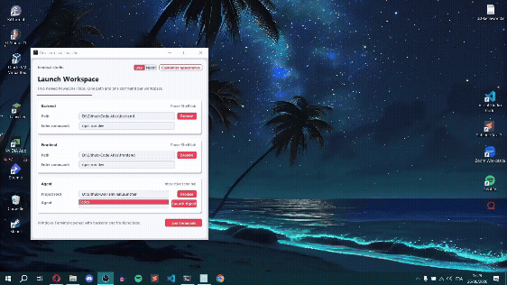

# DevTerminalKit

## Demo

<!-- put demo.gif next to this README, so people see the app before reading docs -->



DevTerminalKit is a tiny desktop launcher for the way i like to start dev work: fast, clear, and without clicking around every time.

I care about small tools that remove boring steps. This app opens the backend and frontend in named Windows Terminal tabs, remembers the paths, and gives me one button to stop the terminal tasks it started. It is not trying to be a full IDE or a big workflow platform. It is just a clean little starter for local projects.

The value is simple:

- open the same workspace terminals every time
- keep backend and frontend commands visible and editable
- launch an agent terminal from the same place
- avoid killing random terminals when ending tasks
- keep the app portable and easy to package

## Clone

Anyone who has access to the repo can clone it with:

```powershell
git clone https://github.com/Seifpetit/DevTerminalKit.git
cd DevTerminalKit
```

If the repo is private, GitHub will ask them to sign in or use a token. If you want everyone to clone it without access, make the repo public in GitHub settings.

## Run From Source

DevTerminalKit uses only the Python standard library and Tkinter.

```powershell
python program.py
```

Requirements:

- Windows
- Python with Tkinter
- Windows Terminal installed, so `wt.exe` is available
- PowerShell, either `pwsh.exe` or `powershell.exe`

## Build The Exe

Install PyInstaller if needed:

```powershell
pip install pyinstaller
```

Build with the included spec:

```powershell
pyinstaller DevTerminalLauncher.spec
```

The packaged app will be created in `dist/`. The `build/` folder is temporary PyInstaller output and is ignored.

## Project Shape

```text
program.py                  app entrypoint
dev_terminal_kit/           app code
DevTerminalLauncher.spec    PyInstaller build recipe
app-icon.ico                Windows app icon
app-icon.png                source icon image
```

The code is split into small modules now:

- `app_config.py` for constants and themes
- `app_settings.py` for saved settings and packaged resources
- `terminal_commands.py` for terminal launch and process cleanup
- `ui_widgets.py` for custom Tkinter canvas widgets
- `ui_tree.py` for the small declarative UI builder
- `launcher_app.py` for the main app window
